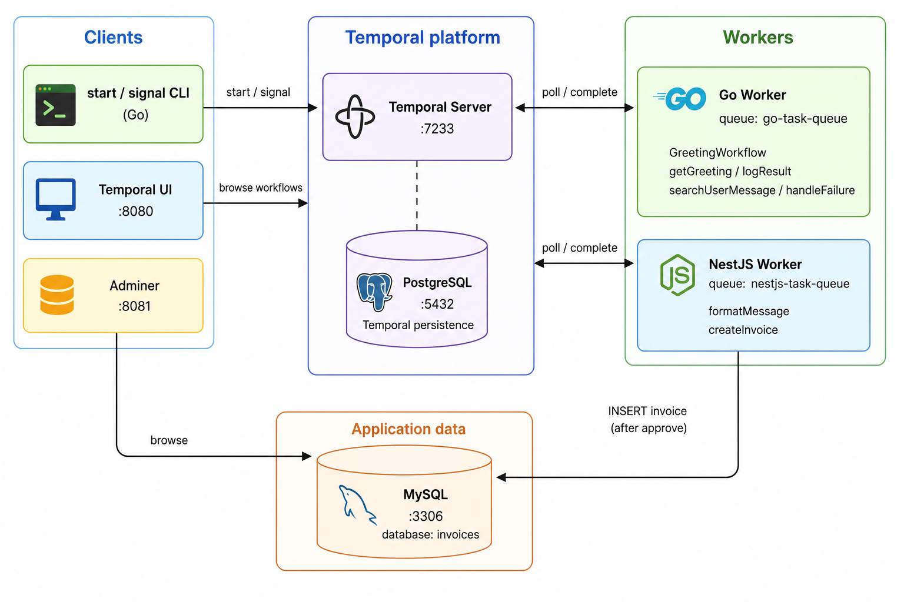
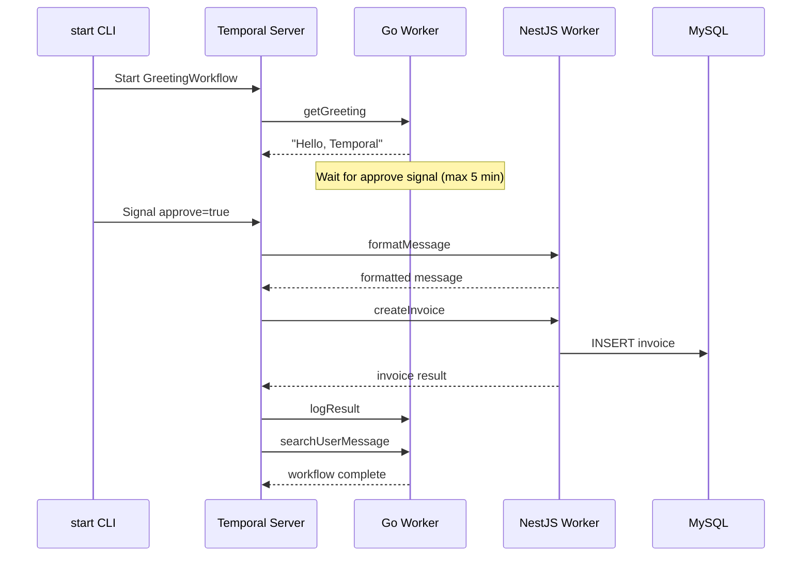

# Temporal Example — Go + NestJS (Docker)

A Docker-based [Temporal](https://temporal.io) example with two workers on separate task queues, plus MySQL for app data (invoices):

- **Go worker** — runs `GreetingWorkflow` and Go activities (`getGreeting`, `logResult`, `searchUserMessage`, `handleFailure`)
- **NestJS worker** — runs TypeScript activities (`formatMessage`, `createInvoice`)
- **MySQL** — stores invoices created **only after** the `approve` signal
- **Adminer** — web DB browser for MySQL

Temporal’s own persistence still uses **PostgreSQL**. MySQL is only for application (invoice) data.

## Architecture




### Runtime flow




## Prerequisites

- [Docker](https://docs.docker.com/get-docker/) and Docker Compose
- Go 1.22+ (optional, for host-side `cmd/start` / `cmd/signal`)


## Quick start

```bash
docker compose up --build
```

This starts:


| Service       | Port | Description                                                 |
| ------------- | ---- | ----------------------------------------------------------- |
| Temporal      | 7233 | gRPC frontend                                               |
| Temporal UI   | 8080 | Web UI — [http://localhost:8080](http://localhost:8080)     |
| PostgreSQL    | 5432 | Temporal persistence                                        |
| MySQL         | 3306 | App DB (`invoices`)                                         |
| Adminer       | 8081 | DB browser — [http://localhost:8081](http://localhost:8081) |
| Go worker     | —    | Workflow + Go activities                                    |
| NestJS worker | —    | NestJS activities + TypeORM                                 |


The Go worker does not auto-start workflows. Use the `start` CLI to trigger one.

## Start a workflow

From the host (with Temporal running on `localhost:7233`):

```bash
cd go-worker
go run ./cmd/start --name Temporal
```

Options:


| Flag           | Default          | Description                                                       |
| -------------- | ---------------- | ----------------------------------------------------------------- |
| `--name`       | `Temporal`       | Input to `GreetingWorkflow` (also used as invoice `customerName`) |
| `--id`         | auto-generated   | Workflow ID                                                       |
| `--task-queue` | `go-task-queue`  | Task queue                                                        |
| `--address`    | `localhost:7233` | Temporal gRPC address                                             |
| `--wait`       | `true`           | Wait for result and print it                                      |


Fire-and-forget (don't wait for completion):

```bash
go run ./cmd/start --name Alice --wait=false
```

Environment variables `TEMPORAL_ADDRESS` and `GO_TASK_QUEUE` are used as defaults for `--address` and `--task-queue`.

## Workflow signals

After `getGreeting`, the workflow **blocks** until it receives an `approve` signal (5 minute timeout).

**Terminal 1 — start workflow** (blocks until approved + complete when `--wait=true`):

```bash
cd go-worker && go run ./cmd/start --name Temporal
```

**Terminal 2 — send approve signal** (use the WorkflowID printed by start):

```bash
cd go-worker
go run ./cmd/signal --workflow-id greeting-workflow-20260716-221739 --approve=true
```

Reject (skips NestJS steps and invoice insert; runs `handleFailure`):

```bash
go run ./cmd/signal --workflow-id greeting-workflow-20260716-221739 --approve=false
```


| Flag            | Default    | Description                    |
| --------------- | ---------- | ------------------------------ |
| `--workflow-id` | (required) | Target workflow ID             |
| `--run-id`      | empty      | Specific run ID (optional)     |
| `--approve`     | `true`     | Boolean payload for the signal |
| `--signal`      | `approve`  | Signal name                    |


## Example workflow

`GreetingWorkflow` runs across Go and NestJS workers:

1. **getGreeting** (Go)
2. **wait for** `approve` **signal**
3. **formatMessage** (NestJS) — only if approved
4. **createInvoice** (NestJS → MySQL) — only if approved
5. **logResult** (Go)
6. **searchUserMessage** (Go)

If the signal is missing (timeout) or `approve=false`, NestJS activities are skipped and Go runs **handleFailure**.

### Invoice activity

After approval, NestJS inserts a row into MySQL via TypeORM (`InvoiceModule` → repository → service):


| Field            | Example                    |
| ---------------- | -------------------------- |
| `customer_name`  | from `--name`              |
| `amount`         | `100.00`                   |
| `currency`       | `USD`                      |
| `status`         | `created`                  |
| `workflow_id`    | Temporal workflow ID       |
| `invoice_number` | auto-generated (`INV-...`) |


Check logs:

```bash
docker compose logs -f go-worker nestjs-worker
```

View the workflow in the UI at [http://localhost:8080](http://localhost:8080).

## MySQL and Adminer


| Setting                  | Value       |
| ------------------------ | ----------- |
| Host (from containers)   | `mysql`     |
| Host (from host machine) | `localhost` |
| Port                     | `3306`      |
| Database                 | `invoices`  |
| User                     | `invoice`   |
| Password                 | `invoice`   |
| Root password            | `root`      |


Open Adminer at [http://localhost:8081](http://localhost:8081):

1. System: **MySQL**
2. Server: `mysql` (from Adminer container) or `localhost` if connecting differently
3. Username: `invoice`
4. Password: `invoice`
5. Database: `invoices`

Then open the `invoices` table to see rows created after approve.

## Project layout

```
.
├── docker-compose.yml
├── temporal-config/
├── go-worker/
│   ├── cmd/
│   │   ├── worker/     # long-running worker
│   │   ├── start/      # CLI to start workflows
│   │   └── signal/     # CLI to send workflow signals
│   ├── workflows/
│   ├── activities/
│   └── Dockerfile
└── nestjs-worker/
    ├── src/
    │   ├── main.ts
    │   ├── invoice/          # entity, repository, service, module
    │   ├── temporal/         # Temporal worker + activity wiring
    │   └── activities/       # formatMessage, createInvoice
    └── Dockerfile
```


## Local development (without Docker for workers)

Start Temporal + MySQL + Adminer:

```bash
docker compose up -d postgresql temporal temporal-ui mysql adminer
```

**Go worker:**

```bash
cd go-worker
export TEMPORAL_ADDRESS=localhost:7233
go run ./cmd/worker
```

**Start a workflow:**

```bash
cd go-worker
export TEMPORAL_ADDRESS=localhost:7233
go run ./cmd/start --name Temporal
```

**NestJS worker:**

```bash
cd nestjs-worker
npm install
export TEMPORAL_ADDRESS=localhost:7233
export MYSQL_HOST=localhost
export MYSQL_PORT=3306
export MYSQL_USER=invoice
export MYSQL_PASSWORD=invoice
export MYSQL_DATABASE=invoices
npm run start:dev
```


## Troubleshooting

**NestJS worker:** `__register_atfork: symbol not found`

The Temporal TypeScript SDK uses a native module (`@temporalio/core-bridge`) that requires **glibc**. Do not use `node:*-alpine` for the NestJS worker — the Dockerfile uses `node:20-bookworm-slim` instead.

**NestJS worker: Unable to connect to the database**

Ensure MySQL is healthy (`docker compose ps mysql`) and `MYSQL_HOST` is `mysql` inside Compose, or `localhost` when running NestJS on the host.

**No invoice row after workflow**

Confirm the approve signal was `true` (not timeout / reject). Check NestJS logs for `createInvoice` and open Adminer → `invoices`.

## Stop

```bash
docker compose down
```

To remove persisted Temporal history **and** MySQL invoice data:

```bash
docker compose down -v
```

